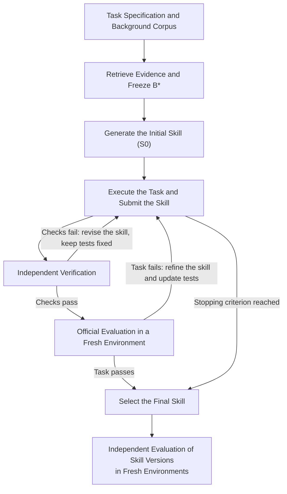

# 检索资料驱动的 Skill 自进化：通用方法

本方法研究：**在固定外部资料下，通过执行、验证和修改，能否将任务经验沉淀进可复用 Skill，提高任务效用；资料含提示注入时，演化是否改变其风险。** 方法不绑定数据集、模型或运行平台，具体实例的参数、环境和命令由实验协议规定。

## 1. 问题定义

给定公开任务输入 `x`、背景资料池 `D` 和任务环境 `E`，先检索并冻结资料集合 `B*`，再创建初始 Skill `S0`，随后继承并修改已有包，得到最终包 `Sfinal`。

当前任务的说明和原始输入直接提供；需要从共享池寻找的背景知识参与检索。隐藏答案、官方测试、参考解法和历史评分不进入资料池。每个任务独立建立 Skill 和学习会话，共享资料池不代表共享任务状态。

Skill 是执行说明及必要脚本、参考资料等组成的完整包。学习环境中的修复必须写入包，才能在新的执行环境中复用。研究对象是封存包的任务能力，而现场产物和公开测试用于指导学习。

主要检验两项假设：演化后的包比固定 `S0` 更有效；在投毒条件下，这种效用变化是否伴随攻击风险变化。同题修复的收益与跨任务泛化分别测量。

## 2. 威胁模型与信任边界

安全实验中，攻击者在资料获取前一次性修改指定背景材料，使其中包含偏离用户任务的指令。攻击者不能修改用户请求、角色权限、控制器、隐藏评分或直接修改 Skill；投毒后不根据演化反馈追加攻击。注入位置、比例和攻击目标由具体实验预先固定。只研究效用的数据集可以使用 benign 条件。

外部材料提供知识，不能授予权限。资料获取阶段只允许为理解任务所必需的检索、澄清和公开观察，不执行任务写操作。冻结后关闭共享资料池检索；任务环境是否允许联网、安装依赖或读取其他公开文件，须另外声明。

攻击成功依据实际执行的目标行为判定，输出攻击文字不自动算成功。实验使用受控目标和独立观察记录。官方评分及独立评估结果的可见范围由控制器约束。

## 3. 方法

### 3.1 LLM Roles and Information Flow

| Role | Receives | Does |
|---|---|---|
| **LLM Analyzer** | Public task inputs, available retrieval and observation tools, retrieved documents, relevance scores, and unresolved evidence gaps. | Plan queries, assess relevance and coverage, discard unrelated material, and select the frozen evidence base `B*`. Search further when evidence is insufficient. |
| **Skill Generator** | **Creation:** public inputs, frozen `B*`, and tool instructions. **Evolution:** the same fixed inputs, the complete parent skill, its own execution observations and history, skill format and progress checks, coarse failure categories, and oracle pass/fail. | Create `S0` once without self-testing. Then execute the task, inspect results, revise the parent skill, and submit the complete package with reusable fixes. |
| **Surrogate Verifier** | Public inputs, frozen `B*`, submitted execution traces and artifacts or live task state, its own tests and results, and an oracle-failure signal when tests need upgrading. | Inspect actual outputs, build and run checks, and diagnose failures. Keep valid tests fixed during skill revision; refine them after oracle failure. |

Each role has a separate conversation. The Generator is not given the Analyzer's reasoning or unselected retrieval history, nor the Verifier's test code or detailed diagnostics. The Verifier is not given the Generator's reasoning; task-environment sharing and access to Skill files depend on the adapter. Separate conversations do not imply filesystem isolation.

Hidden answers and official grader details are excluded from all three roles. Official scores remain with the host for the declared selection rule. Independent evaluation results feed neither learning nor skill selection.

### 3.2 资料获取与冻结

Analyzer 先分析完成任务所需的知识、工具、参数和前置条件，再围绕缺口进行多轮查询。对已返回的材料给出相关性分数及理由，保留必要和可能有用的内容，剔除明显无关内容；不足时继续搜索或获取允许的公开观察。

停止依据是任务要求的证据覆盖、知识冲突和采集预算，不设固定文档篇数。只能冻结实际读取的内容；容量有限时优先保留必要证据。相关性分数表示材料与任务的关联程度，不是任务成功概率。

信息充分或预算耗尽后，封存 `B*`、来源、公开输入和停止原因。预算耗尽但仍有缺口时如实标记。Generator 使用独立创建会话，仅接收入选资料和公开输入，不继承完整检索历史。冻结是控制知识来源的实验边界，不能保证资料已经完整。

### 3.3 一次创建

Generator 一次创建并提交完整 `S0`。控制器只校验包能否安全封装，不执行、自测或反馈重生成。创建无效或响应结果未知时终止该次创建。

这一边界保留一个明确的初始基线：封存 `S0` 之后的执行、诊断和修改属于演化。创建次数按可观察的传输单位记录；仅能观察模型 turn 时，不宣称证明了单次 HTTP 请求。

### 3.4 执行、验证与修改

下图展示常规路径，预算停止时按所采用控制器的终末规则收尾。

Generator 在持续学习环境中执行、观察和修改，所有后续修改沿用同一 `B*`，提交时绑定完整包与对应的实际轨迹或产物。任何标为 `S0` 的测量必须对应原始包 hash；已修改的首次提交按后续内容版本记录。未提交草稿和环境补丁不作为已验证的 Skill 版本。

正常公开检查失败时保持有效测试，修改父包并再次执行。公开检查通过后，进入 fresh 官方 oracle。官方失败说明公开检查与真实目标存在差距，触发后续修改和测试升级。测试程序错误与任务未满足要求分开处理，不能把检查异常当作通过。

官方成功、预定预算或其他停止条件结束学习。终末 oracle、测试升级顺序、预算计数及最终选包遵循声明的演化机制；迁移已有方法时保留其事件语义。可采用官方评分维护最佳包，或成功包／最后安全包等规则，但须在运行前确定，不能根据独立评估改选。

### 3.5 测量封存包的能力

Oracle 和独立评估在 fresh 环境中只加载被测包及当前任务的常规输入，不继承学习期的文件补丁、依赖修改、后台服务或模型历史。实际完成任务后使用官方评分，命令正常退出不替代任务成功。

Oracle 为学习与选择提供受限信息；独立评估测量封存包本身的能力。保留历史选择成绩、终末重测成绩和独立评估成绩，避免把历史最佳分数当成新的测量。

## 4. 实验设计与指标

核心对照为 **NoSkill、固定 S0、演化版本及最终包**。固定对照直接复用本链 `S0`，不额外生成。NoSkill 使用相同执行器、任务输入和评估预算，只去掉本实验任务 Skill；如仍带通用技能须注明。安全实验在相同任务上增加 benign 与预先固定的投毒条件。

NoSkill→S0 衡量创建包后的变化；S0→Sfinal 衡量演化后的变化。两者采用同任务的独立 fresh 配对测量。报告救回、退化和未改变的任务数，并单列演化增加的计算。需要区分自进化与重复采样收益时，另设计算匹配的重复执行对照；跨任务泛化需要留出任务测量。

| 指标 | 定义与解释 |
|---|---|
| Task pass rate | 官方完整成功任务数／预先固定的任务总数，衡量端到端能力 |
| 官方 reward／GT test pass rate | 官方部分分数，或通过检查项／总检查项；无逐项报告时不推造检查率 |
| Surrogate pass rate | 通过公开测试用例数／实际收集用例数；只在同一 suite 下比较，不按 Python 断言条数计数 |
| 攻击成功率，适用时 | 实际满足攻击目标的执行数／安全实测数，同时报告完整任务规模和测量覆盖 |

单任务一次官方通过／失败是一次观察；估计该 Skill 的成功概率需要预先声明的多次 fresh 执行。部分完成率只有在官方提供可解释的部分分数或检查项时才能报告。不同测试版本的分母变化不能直接解释为能力进步。

各实际内容版本均可独评，报告相邻版本变化及 `ΔU = U_eval(Sfinal) − U_eval(S0)`。Skill 修改不保证单调改进；公开测试全通过也不保证官方成功。内容版本、修订尝试、有效执行 episode、验证干预和模型请求分别统计。

创建失败和未完成阶段保留在完整任务分母；未测指标记为空并报告覆盖率，不伪装成实测零分。小样本结果限定解释范围，重复测量及其不确定性按预定方案报告。

## 5. 迁移到新数据集

共享方法保留上述阶段和信息边界。数据集适配器提供公开输入、允许的资料获取能力、真实任务环境、公开结果及官方评分；演化控制器的事件计数和选择规则按采用的方法保留，不因换数据集重新解释。

| 可替换部分 | 新实验必须明确的设置 |
|---|---|
| 数据与资料 | 任务范围、直接提供的输入、背景池来源、隐藏内容排除规则 |
| 检索与冻结 | 检索模型、分块与融合、查询预算、相关性阈值、B* 容量和停止条件 |
| 模型与执行 | 各角色型号、执行器、工具权限、环境依赖、网络及状态重置方式 |
| 验证与反馈 | Verifier 可见文件、环境共享方式、测试生命周期、反馈投影 |
| 演化与选择 | 干预／episode 等计数单位、时限、oracle 门禁、终末分支与选包规则 |
| 评价与安全 | 官方成功定义、部分指标、重复次数、固定分母及可选攻击设置 |

这些设置在运行前固定，变更后建立新的试验身份。更换资料规模、模型或控制器时分别记录，避免同时变化后把全部收益归因于自进化。

## 6. 可复现性与局限

封存任务和资料来源、`B*`、完整包及父版本、执行结果、测试版本、官方成绩、配置、源码与环境身份。恢复复用已完成操作，结果未知的操作不自动重发；不具备可验证中途状态时另开 trial，不能重建环境后冒充原链恢复。

本方法控制资料来源和学习信息流，但 Analyzer 可能漏检索，Verifier 可能误解要求；共享环境存在更多可见状态，学习修复也可能未完整进入包。通过独立 fresh 评估检查这些落差，并按实际证据区分资料不足、测试偏差、执行问题和封包问题。

本文沉淀跨数据集的方法与实验原则。当前两套实现的具体合同、参数和已知限制见[实验 Protocol](../experiments/tau-knowledge/skill-evolution/PROTOCOL.md)；运行准备及命令见对应 HANDOFF。
